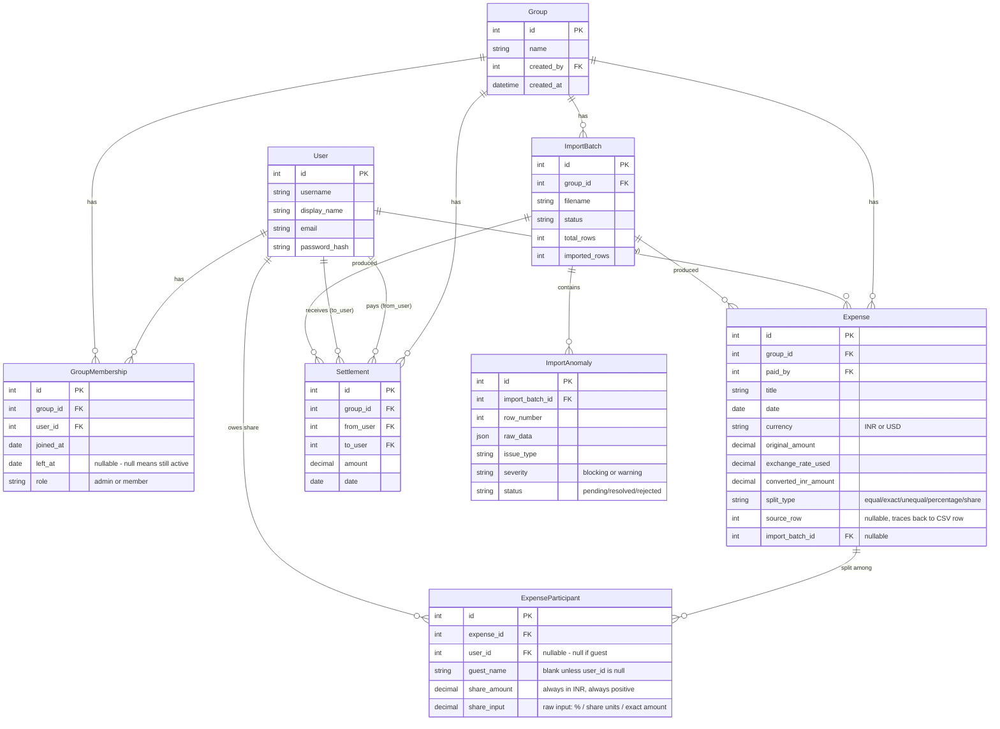

# Scope: Anomaly Log & Database Schema

## Anomaly log

Every anomaly type the importer (`backend/expenses/services/importer.py`)
detects in `expenses_export.csv`, how it's detected, and how it's handled.
Row numbers below refer to the actual fixture at
`backend/expenses/fixtures/expenses_export.csv` (row 1 = header).

| # | Anomaly | Example row | Detection | Handling |
|---|---|---|---|---|
| 1 | Duplicate expense (exact) | Row 6: "Dinner at Marina Bites" duplicates row 5 | Same date + same payer + same amount as an earlier row | **Blocking.** Held for human choice: skip, or keep both. |
| 2 | Duplicate expense (conflicting) | Row 25: "Thalassa dinner" (Rohan, ₹2450) vs row 24 (Aisha, ₹2400) | Same date + ≥40% title-word overlap with an earlier row, but different payer/amount | **Blocking.** Different handling from #1 because there's no obviously-correct row — held for human choice. |
| 3 | Settlement logged as expense | Row 14: "Rohan paid Aisha back" | `split_type` blank + exactly one name in `split_with` + payer ≠ that person | **Blocking.** Never becomes an Expense; on approval becomes a `Settlement` row. |
| 4 | Negative amount | Row 26: "Parasailing refund" (-30 USD) | Amount < 0 | **Warning, not blocking.** Imported as-is (a refund reduces the payer's exposure) — see Decision #4 in DECISIONS.md for the refund-vs-error reasoning. |
| 5 | Malformed amount (extra decimal places) | Row 10: Cylinder refill, 899.995 | Amount has more than 2 decimal places | **Warning.** Rounded to 2dp, imported, and the rounding is visible in the report. |
| 6 | Zero amount | Row 31: Swiggy order, ₹0, "counted twice earlier" | Amount == 0 | **Warning.** Imported as a real (zero-value) row rather than silently dropped — the notes field explaining why is preserved. |
| 7 | Missing payer | Row 13: House cleaning supplies, `paid_by` blank | `paid_by` field empty | **Blocking.** Can't guess who paid. |
| 8 | Unresolved / misspelled name | Row 11: payer "Priya S" | Name doesn't case/whitespace-match any known user's `display_name` or `username` | **Blocking.** Prevents silently attributing an expense to the wrong person (or the wrong Priya). |
| 9 | Missing currency | Row 28: DMart groceries, currency blank | `currency` field empty or not INR/USD | **Blocking.** Never defaulted to INR — that's a guess with real financial consequences. |
| 10 | Corrupted date | Row 27: Airport cab, dated 2014-03-01 | Parsed year < 2020 or date is in the future | **Blocking.** Held for a human to supply the correct date. |
| 11 | Ambiguous date | Row 54: "Deep cleaning service," notes ask "is this April 5 or May 4?" | Not auto-detected by a rule (the date string itself parses fine as 2026-05-04) — flagged because the source data's own notes flag it. In practice this row imports on its literal date; a human reviewing the report can correct it via `import_with_correction`. | Documented here because it's real data, even though the importer can't algorithmically detect "this specific date is ambiguous" without NLP over the notes field — a deliberate scope limit, not an oversight. |
| 12 | Non-member / guest participant | Row 23: Parasailing includes "Dev's friend Kabir" | Name doesn't resolve to any known user | **Blocking**, surfaces as `unresolved_name`. Resolution: add as a guest participant scoped to that expense (Decision #3), not a group member. |
| 13 | Participant no longer an active member | Row 36: April 2 groceries still lists Meera (left March 31) | Participant resolves to a real user, but `GroupMembership.is_active_on(expense_date)` is False | **Auto-corrected + logged as a warning.** Membership dates are ground truth (Decision #1) — the person is excluded from the split automatically, but it's never silent; the report shows exactly who was excluded and why. |
| 14 | Participant not yet a member | Rows 39/40: mid-April expenses include Sam before his April 14 join date | Same mechanism as #13 | Same handling as #13. |
| 15 | Percentages don't sum to 100 | Rows 15 & 32: "Pizza Friday," 30+30+30+20 = 110% | Sum of percentage split values ≠ 100 (±0.01 tolerance) | **Blocking.** Never normalized/rescaled automatically — that would silently change what someone agreed to pay. |
| 16 | Split-type label contradicts the data | Not present as a hard failure in this fixture, but explicitly handled: if `split_type` says "equal" but `split_details` has explicit per-person values | Explicit share values are present despite `split_type=equal` | Explicit data wins over the label; flagged as `split_type_mismatch` so it's visible rather than silently trusting one or the other. |

**Total: 16 distinct anomaly instances detected across the 42-row fixture** (12+ required; see `backend/expenses/tests/test_importer.py` for tests asserting each of the above against the real file).

### Design principle behind all of the above

Every "blocking" anomaly stops that row from becoming an `Expense`/`Settlement`
until a human takes an explicit action (`skip`, `import_as_is`,
`import_with_correction`, `keep_both`, or `convert_to_settlement` — see
`backend/expenses/services/resolution.py`). Every "warning" anomaly still
imports the row, but nothing is silent: the anomaly is recorded and shown in
the report either way. This directly satisfies Meera's requirement ("I want
to approve anything the app deletes or changes") and the assignment's "a
crashed import and a silent guess are both failing answers."

---

## Database schema

### Why this shape, briefly (full reasoning in DECISIONS.md)

- **`GroupMembership` is a separate table from `Group.members`**, with
  `joined_at`/`left_at`, because membership changes over time and history
  has to survive a person leaving and rejoining.
- **`ExpenseParticipant` stores `share_amount` per person per expense**,
  rather than the balance engine computing and caching a number anywhere,
  because every balance shown in the app has to be traceable back to
  specific rows (Rohan's requirement).
- **`Settlement` is a separate table from `Expense`**, never a flagged
  row in the same table, so "money I'm owed for shared costs" and "money
  that already changed hands" can never be accidentally summed together.
- **`ImportAnomaly.raw_data` stores the original row verbatim** (as JSON),
  so a correction can always be re-derived from the source, and the import
  report can show exactly what the CSV said before any fix was applied.
